# Risk-Guided Intensity Mapping (RIM)


Official MATLAB implementation for the paper **"Risk-Guided Intensity Mapping for Mitigating Amplification Artifacts in Low-Light Image Enhancement"**.

In this paper, we propose **RIM (Risk-Guided Intensity Mapping)**, a lightweight and highly efficient post-processing framework designed to amplification artifacts introduced by existing low-light image enhancement (LIE) algorithms. 


## Visual Results


| Method | Input | Initial LIE Enhanced | Proposed (RIM) |
|:---:|:---:|:---:|:---:|
| **HE** | 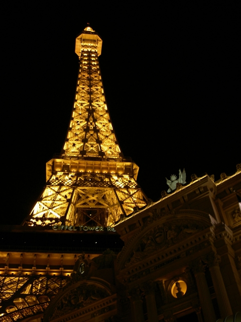 | 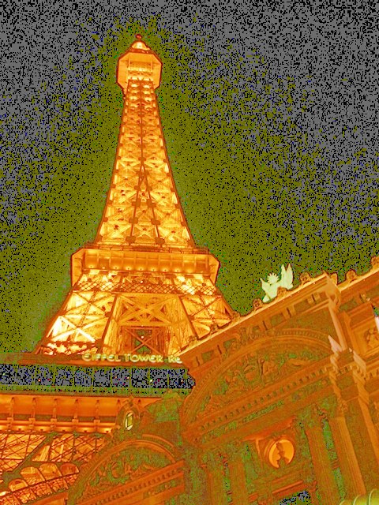 | 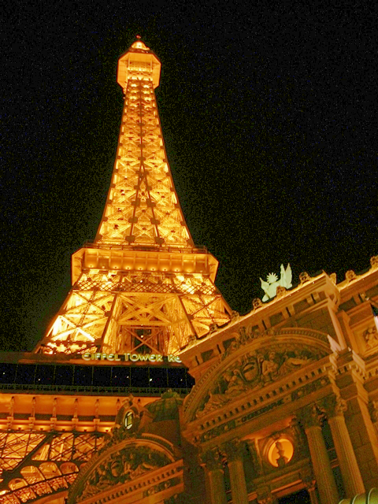 |
| **Zero-IG** |  | 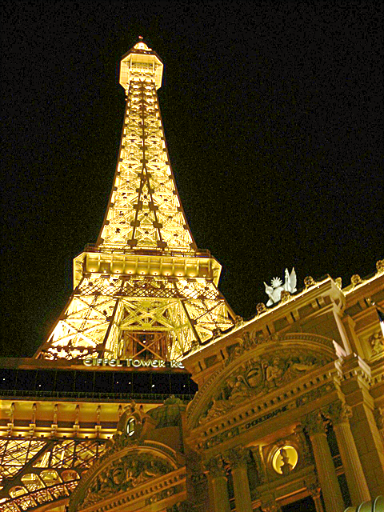 | 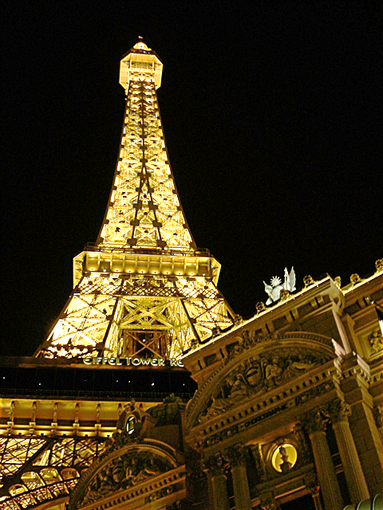 |
| **PairLIE** | 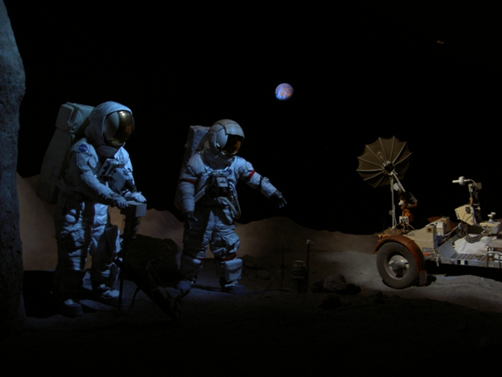 | 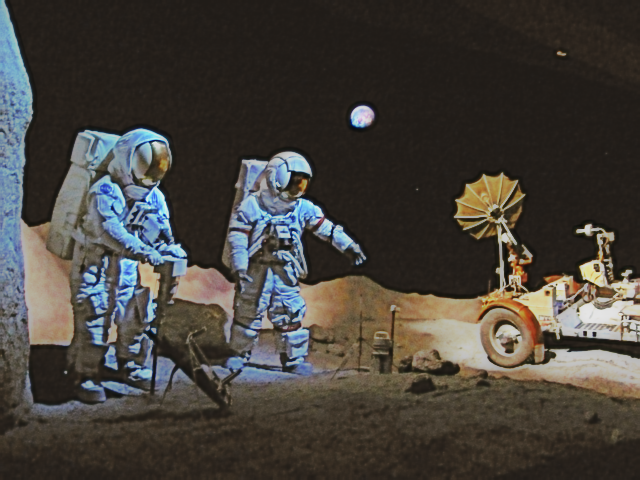 | 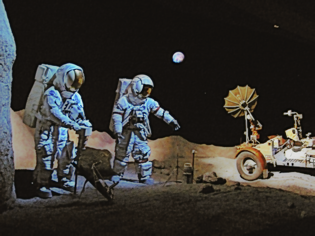 |
| **RG-CACHE** |  | 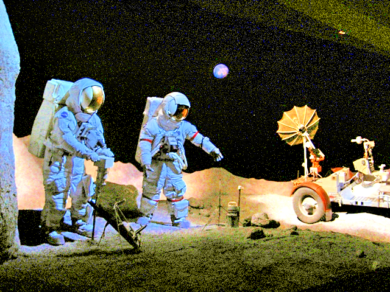 | 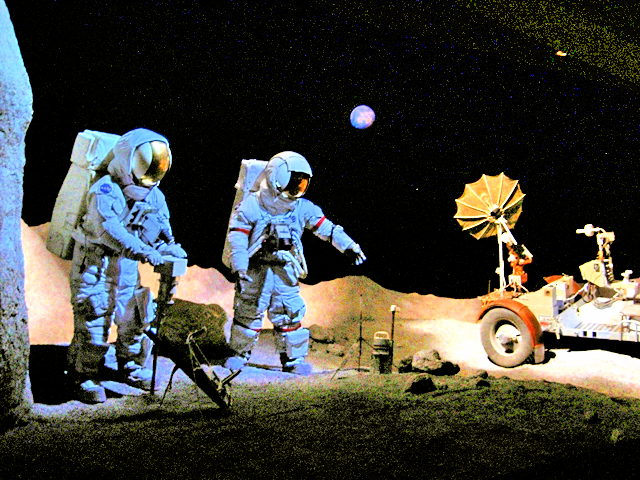 |
| **Zero-DCE** | 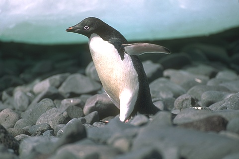 | 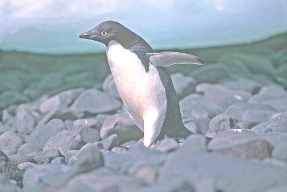 | 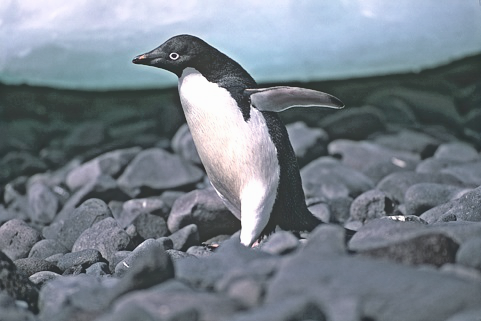 |
| **EnlightenGAN** | 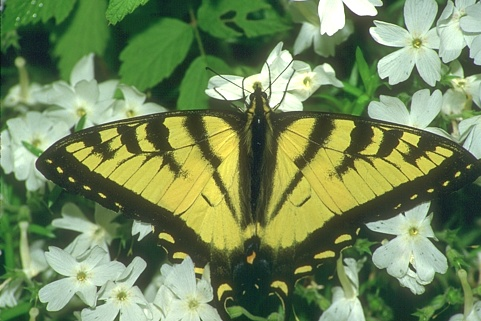 | 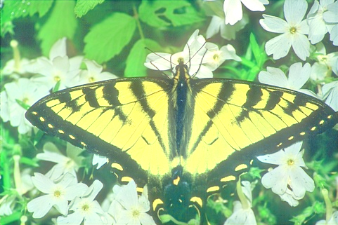 | 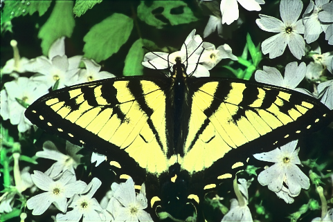 |


## Project Structure

Please ensure your directories are organized as follows before running the demo:

```text
RIM/
├── demo_RIM.m
├── RIM.m 
├── Images/
│   ├── Input/            # Place original low-light images here
│   ├── Initial_enhanced/ # Place initially enhanced images (e.g., Histogram Equalization) here
│   └── Output/           # Enhanced results will be saved/displayed here
└── README.md
```

## Requirements

* MATLAB (Tested with MATLAB R2025a, but it should work seamlessly on recent versions)
* Image Processing Toolbox

## How to Run

1. **Clone the repository:**
   ```bash
   git clone https://github.com/sykim378/RIM.git
   cd RIM
   ```

2. **Prepare your images:**
   * Place a low-light input image in `Images/Input/` (e.g., `01.JPG`).
   * Place the corresponding initially enhanced image in `Images/Initial_enhanced/` (e.g., `HE/01.png`).
   * *Note: Open `demo_RIM.m` and update `inputPath` and `enhancedPath` to match your actual file paths if they are different.*

3. **Run the script in MATLAB:**
   * Open MATLAB and navigate to the cloned `RIM` folder.
   * Run the demo script in the MATLAB Command Window:
     ```matlab
     demo_RIM
     ```
   
   The script will process the image using the proposed RIM algorithm and automatically display a figure comparing the **Original Input**, **Initial Enhanced**, and **Proposed RIM Output**.

## Parameters
You can adjust the following parameters inside the script to test with your own images:

* `thresholdRatio` (Default: `5`)
  * The threshold used to identify risk regions. The algorithm is robust to this value, but you can adjust it to fine-tune the sensitivity of risk detection.
* `targetPSNR` (Default: `36`)
  * Controls the allowable degradation caused by noise amplification. 
  * **Note:** This does *not* represent the output PSNR. A lower value (e.g., 20) preserves more of the original enhancement, while a higher value (e.g., 100) applies aggressive noise/artifact suppression. The recommended practical range is 32–40.

## Citation
If you find this code useful for your research, please consider citing our paper:

    @article{kim2026rim,
      title={Risk-Guided Intensity Mapping for Mitigating Amplification Artifacts in Low-Light Image Enhancement},
      author={Kim, Sang-yun and Lee, Yun-gu and Hwang, Je-jung},
      journal={TBD},
      year={2026}
    }

## Contact
If you have any questions or encounter issues, please feel free to open an issue or contact: 
eapsy1ka@gmail.com
